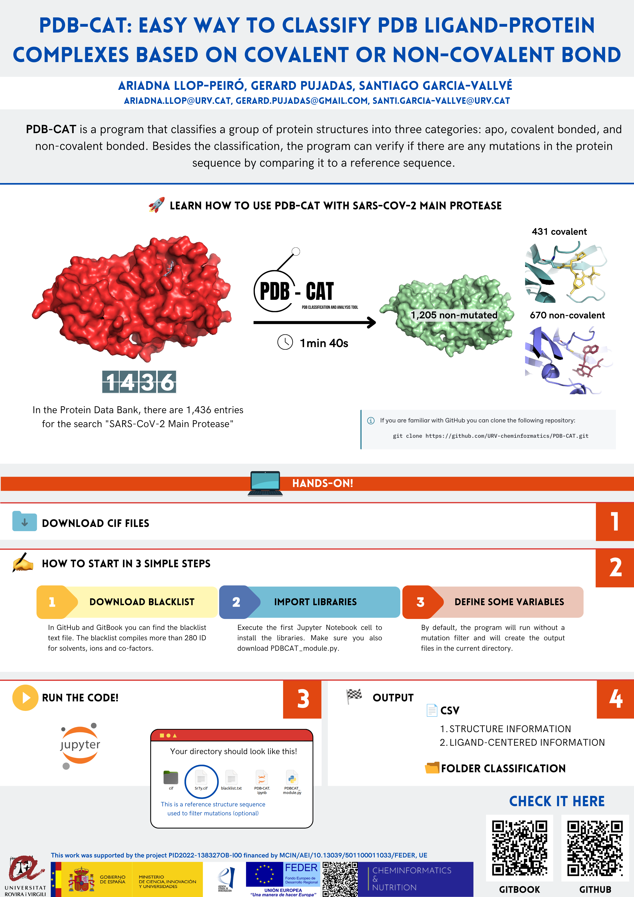

# PDB-CAT: Classification and Analysis Tool 

<a target="_blank" href="https://colab.research.google.com/github/URV-cheminformatics/PDB-CAT/blob/main/PDB-CAT-colab.ipynb">
  
</a>

PDB-CAT is a Jupyter Notebook that aims to automatically categorize the PDB structures based on the type of interaction between atoms in the protein and the ligand, and checking for any mutations in the sequence. PDB-CAT is a program that classifies a group of protein structures into three categories: free-ligand, covalent bonded, and non-covalent bonded. Besides the classification, the program can verifies if there are any mutations in the protein sequence by comparing it to a reference sequence. The program outputs a CSV file with structural information, which can then be used for further analysis, such as virtual screening or molecular docking. PDB-CAT is user-friendly and can be customized to meet specific needs.

[](https://ariadnallopps-organization.gitbook.io/pdb-cat/)

## Documentation


## Installation

Python3.10 or higher is required.
Install required packages using:

```bash
  pip install -r requirements.txt
```


## Quickstart

Option 1. Clone 

```bash
  git clone https://github.com/URV-cheminformatics/PDB-CAT.git

```

Option 2. Download

1. Click on the green button labeled '<>Code' in the top right corner
2. Select 'Download zip'

You now have a copy of the repository's files saved as a zip file on your local computer. You can edit and customize the files for your own purposes.

For more information:

[Downloading files from GitHub webpage](https://docs.github.com/en/get-started/quickstart/downloading-files-from-github)


## Dataset

In order to create the Dataset there are two options:

1. Search your protein target in Protein Data Bank and download the PDBx/mmCIF files in batches

```bash
  gunzip *.gz # Decompress downloaded .gz
  find batch-download-structures-* -type f -exec mv {} . \ # Move files from the compress batch files
  gunzip *.gz # Decompress downloaded .gz
  mv *.cif cif/ # Move into cif directory
```

2. Download the structures of known IDs with the following executable:

  [batch-download script](https://www.rcsb.org/docs/programmatic-access/batch-downloads-with-shell-script)

  **-f** specify input file with id separate by comma

  **-c** for cif-gz file

  **-o** specifiy output path

```bash
  ./batch_download.sh -f input.txt -c -o /output # execute to download by ID names
  gunzip *.gz # Decompress downloaded .gz
```

Note: The dataset must be in the /cif directory before executing the program.

## Variables

To run this project, you will need to add the following variables to your main code

```python
  out_file = '/home/...' # Path and name of the csv output file
  mutation = True # Analyze mutations. True or False
  output_path = '/home/...' # Path of the output folders
  pdb_reference_sequence = '/home/.../PDB-CAT/*.cif'  # Path to the pdb file that will be the reference sequence
  entity_reference = 0 # '0' means that the first _entity_poly of the pdb_reference_sequence will be the reference sequence

```

### Choose to use mutation filter
Mutation = True (useful in case you are using the same protein dataset of structures)
    
Mutation = False (useful in case your are working with different proteins)


## Blacklist

The blacklist compiles more than 280 codes for solvents, ions, co-factors, and other substances capable of bonding with the protein structure. 
This information is stored in a text file that users can edit, allowing for the inclusion of new codes or adjustments related to the significance of co-factors and solvents in the analysis.


## Usage/Examples

Main Protease SARS-CoV-2 Example

Users can follow the procedure in the example directory, making modifications to the main code variables and exploring their possibilities


## Extra

**Best-poster Prize in Strabourg Summer School in Chemoinformatics 2024**

