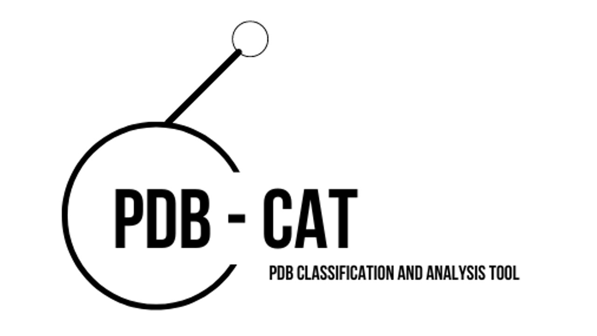
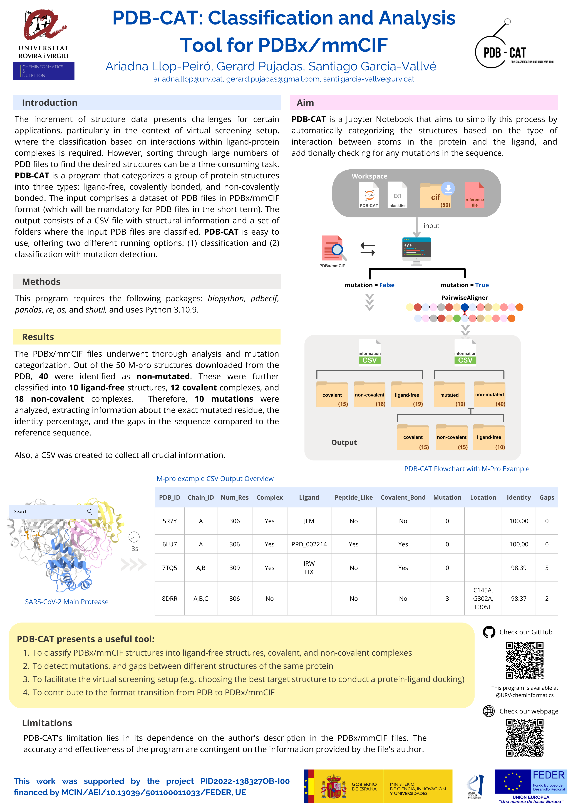

# PDB-CAT: Classification and Analysis Tool (beta version)

PDB-CAT is a Jupyter Notebook that aims to automatically categorize the PDB structures based on the type of interaction between atoms in the protein and the ligand, and checking for any mutations in the sequence. PDB-CAT is a program that classifies a group of protein structures into three categories: free-ligand, covalent bonded, and non-covalent bonded. Besides the classification, the program can verifies if there are any mutations in the protein sequence by comparing it to a reference sequence. The program outputs a CSV file with structural information, which can then be used for further analysis, such as virtual screening or molecular docking. PDB-CAT is user-friendly and can be customized to meet specific needs.

# Overview

# Setup
## Packages
- Use Python 3.10
- Install required packages using:

    pip install -r requirements. txt in your terminal

## Dataset
- Search your protein target in Protein Data Bank
- Download the PDBx/mmCIF files 
    If you download in batches:
    1. Decompress downloaded .gz
    *gunzip *.gz*
    2. Move files from the compress batch files
    *find batch-download-structures-* -type f -exec mv {} . \;*
    3. Decompress downloaded .gz
    *gunzip *.gz*
    4. Move into cif directory
    *mv *.cif cif/*

# How to use
## Variables
It is necessary to define the main code variables.
- Path and name of the csv output file
    out_file = '/home/...'
- Analyze mutations. True or False
    mutation = True
- Path of the output folders
    output_path = /home/...'
- Path to the pdb file that will be the reference sequence
    pdb_reference_sequence = '/home/.../PDB-CAT/*.cif' 
- '0' means that the first _entity_poly of the pdb_reference_sequence will be the reference sequence
    entity_reference = 0 

## Choose to use mutation filter
Mutation = True to use the mutation filter
    It is useful in case you are using the same protein dataset of structures
Mutation = False
    It is useful in case your are working with different proteins

# Blacklist
The blacklist collects over 280 solvent, ion, co-factor, etc. codes that can bond to the protein structure. 
It is a text file that users can modify in case new codes are found.

# Main Protease SARS-CoV-2 Example
Users can follow the procedure in the example directory, making modifications to the main code variables and exploring their possibilities.
