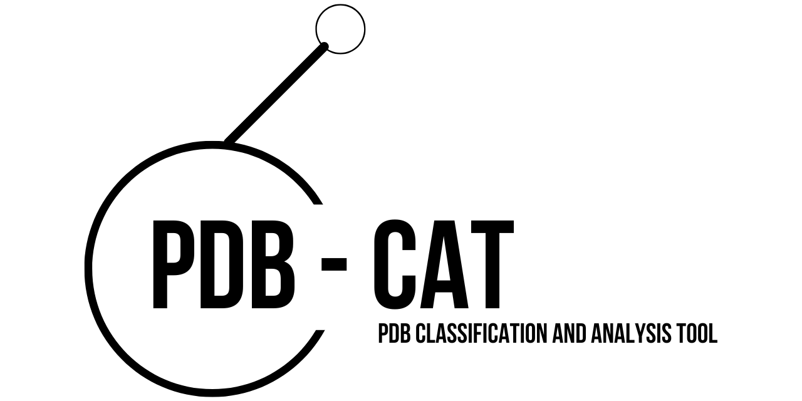
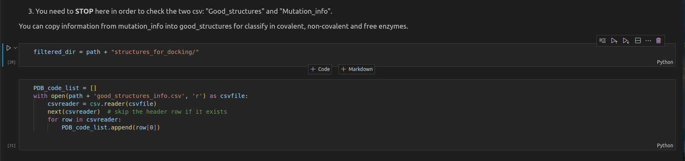
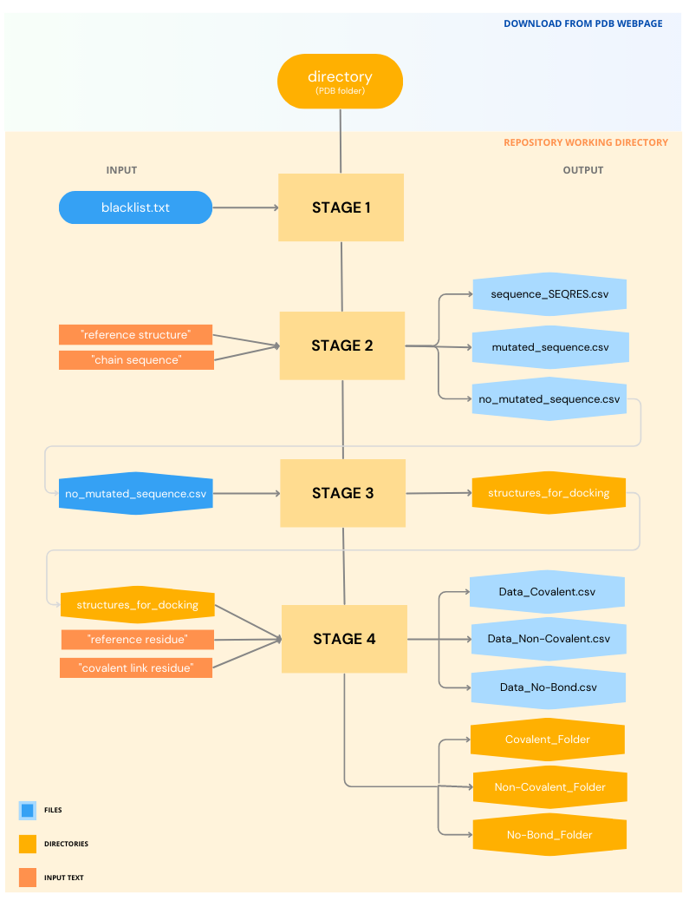
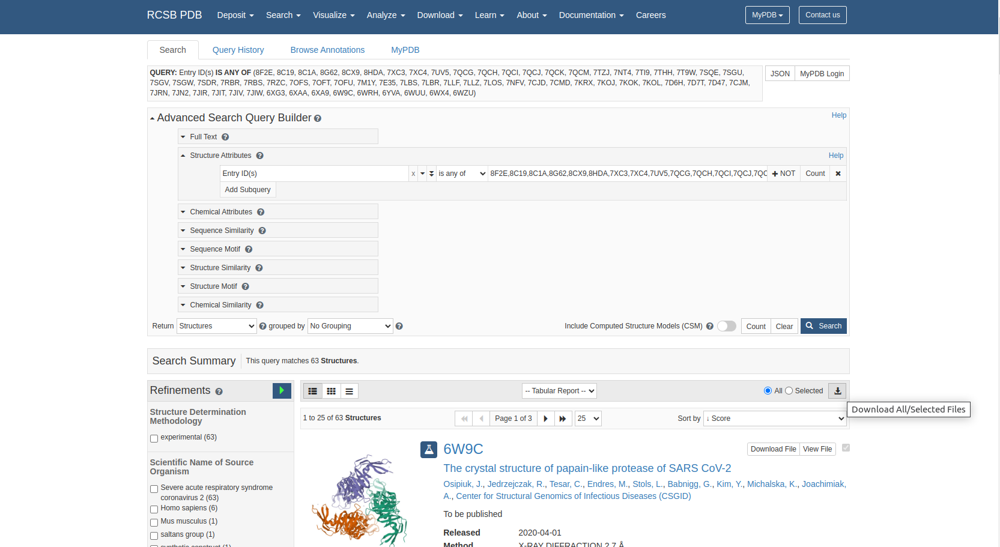
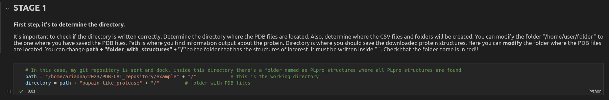
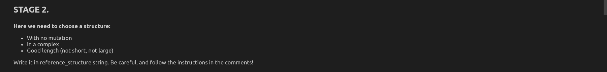
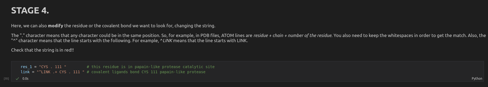
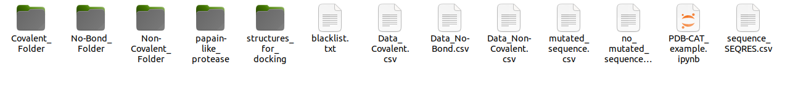

# PDB-CAT

PDB files contain structural information about proteins and other biomolecules, and are widely used in Drug Discovery. However, sorting through large numbers of PDB files to find the desired structures can be a time-consuming task. PDB-CAT is a Jupyter Notebook that aims to simplify this process by automatically categorizing the structures based on the type of interaction between atoms in the protein and the ligand, and checking for any mutations in the sequence. PDB-CAT is a program that classifies a group of protein structures into three categories: covalent bonded, non-covalent bonded, and no-bonded. Before classification, the program verifies if there are any mutations in the protein sequence by searching for the amino acid sequence located in the SEQRES lines of the PDB file and comparing it to a reference sequence. The program outputs a file with structures that meet the specified criteria, which can then be used for further analysis, such as virtual screening or molecular docking. The program is easy to use and can be customized to fit the user's specific needs.

## REQUIREMENTS
This program requires the following packages:
- Biopython
- os
- re
- csv

You can install these packages using pip:
    $ pip install <library>

*You do not need extensive knowledge of these libraries.*

## USAGE
This program takes PDB files locally saved as an input. It classifies the batch structures based on their type of complexes. The classification is based on the type of interaction between atoms in the structure, it has three categories:

1. Covalent: if the structure contains a LINK information line in the PDB file
2. Non-covalent: if the structure contains at least one non-covalent bond with a peptide
3. No-bond: if the strucutre has not bond at all, it bonds solvents or ion molecules (described in blacklist)

In this repository, a text file is attached. The text file named *blacklist* and is used to keep track of all groups identified as non-ligand in a protein structure. HET group refers to a non-standard or "heterogeneous" group of atoms within a protein or nucleic acid structure that are not part of the standard building blocks of amino acids or nucleotides. These can include small molecules such as cofactors, and inhibitors that bind to the protein, as well as metal ions and solvent molecules that are present in the crystal structure.This molecules are assigned a unique identifier within the PDB, which allows researchers to easily reference them and study their interactions with the protein. They are typically represented using three-letter codes, such as "ADP" for adenosine diphosphate or "HEM" for heme.

Additionally, before the classification the program checks if there are any mutations in the sequence. To do this, the program searches for the aminoacids sequence (located in SEQRES lines of PDB file) and compares them to a reference sequence. If there are any differences, the program reports that there is a mutation, where is it, how many gaps has the chain sequence and what is the % of identity to reference sequence.

## MODIFICATION

Every code cell where user needs to modify information is marked in 4 stages. In the stage 3, the user need to make a  **** and to modify the first output. Then, the program can carry on the previous functions.

## INPUT

Part of the input files is *blacklist.txt*. It is necessary to ensure that the blacklist.txt file is located in the working directory before running the program, as it is a required input file.

This code consists of two main parts.

- In the first part, the code reads PDB files and extracts information to create three CSV files:

*sequence_SEQRES*: This file contains the amino acid sequence of the protein from the SEQRES records of the PDB file, which is compared to a reference sequence to identify any mutations or gaps.

*no_mutated_sequence*: This file contains information about the quality of the PDB structures, including resolution and R-factor values, which are used to filter out structures with poor quality.

*mutated_sequence*: This file contains information about mutations in the protein sequence, including the type of mutation and the position of the mutated residue.

- In the second part, the code creates four output folders:

*structures_for_docking*: This folder contains all the PDB files that are suitable for docking studies.

*Covalent_Folder*: This folder contains PDB files of covalently bound protein-ligand complexes.

*Non-Covalent_Folder*: This folder contains PDB files of non-covalently bound protein-ligand complexes.

*No-Bond_Folder*: This folder contains PDB files of unbound proteins (also known as apo-structures).

In addition to the output folders, the code also generates three CSV files:

*Data_Covalent*: This file contains information about covalent interactions between the protein and the ligand, including the bond type, bond length, and the atoms involved in the bond.

*Data_No-Bond*: This file contains information about unbound proteins, including the root-mean-square deviation (RMSD) of the protein structure and the presence of any pockets or cavities.

*Data_Non-Covalent*: This file contains information about non-covalent interactions between the protein and the ligand, including the types of interactions (e.g., hydrogen bonds, van der Waals interactions), the distances between interacting atoms, and the orientation of the ligand in the binding site.

Overall, this code is designed to analyze and categorize protein-ligand complexes based on their structural and chemical features, providing useful information for drug discovery and other applications in structural biology.

## OUTPUT

The program outputs the following information:

The classification of the structure (covalent, non-covalent, or no bond).
- If the structure is classified as non-covalent, the program also reports the type of non-covalent interaction present in the structure (hydrogen bond, salt bridge, etc). 
- If the program detects a mutatiion, it reports the position of the mutation and the aminoacids change, gaps and identity %. Also, you can access to a csv with all no-mutated structures to check the length and gaps these.

## EXAMPLE
A research group needs to study PLpro *in silico*. In order to do a virtual screening, on or two structures have to be chosen. For this reason, this program will help on a database inspection and classification. 

Previously to run the code, a batch of structures should be downloaded. The users of this program should be familiarized with the target, in this example, PLpro and also, how ligand acts in catalytic site. 

*A PDB search is been done, therefore, next step should be *download all*.*

First of all, *in the first point*(1), the user needs to modify the code, specifically: **path** and **directory**. 

Path: where ouput files are created
Directory: where input files should be saved before running the program

In the *second point*(2), structure and chain of reference should be chosen. In this case, the group choses 7JIW, as it has no mutation, it is in a non-covalent complex and also has a reference length (not short, not large) with no gaps in between.

Here the reference structure would be 7JIW.ent from the PDB, and the reference chain would be the A chain.

In *third point*(3), we are going to **STOP** as two csv files has been created. You should go to your **path** directory and check those sequences in *mutation_info* and in *good_structures*. It has to be known that only *good_structures* PDB files will be classify.

For example, the idea is to eliminate rows in *first_output_no-mutated* that have short length or to add some rows of *mutation_info* row as it maybe have a mutation isolated from the binding site.

*This is how the first input looks like. From now on, the program will take this information to make the complexes classification. Remember to save as csv!*

Finally, *the forth point*(4) is to chose a residue of key importance, and also the one that bind with covalent bond. 

In this case, it would be the Cys111. 

After the classification:
We see three folders: Covalent_Folder(4), Non-Covalent_Folder(16) and No-Bond_Folder(3); and also, three csv with the binding information: Data_Covalent.csv, Non-Covalent_Folder.csv, Data_No-Bond.csv.

## LIMITATIONS

One potential limitation of the PDB-CAT program is that the program requires the user to have a basic understanding of Python programming and the Biopython package, which may be a barrier for some users who are not familiar with these tools.