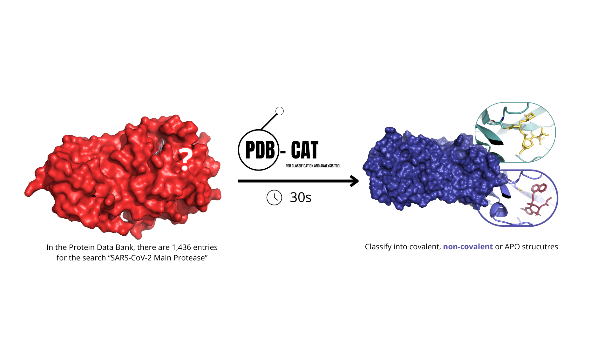
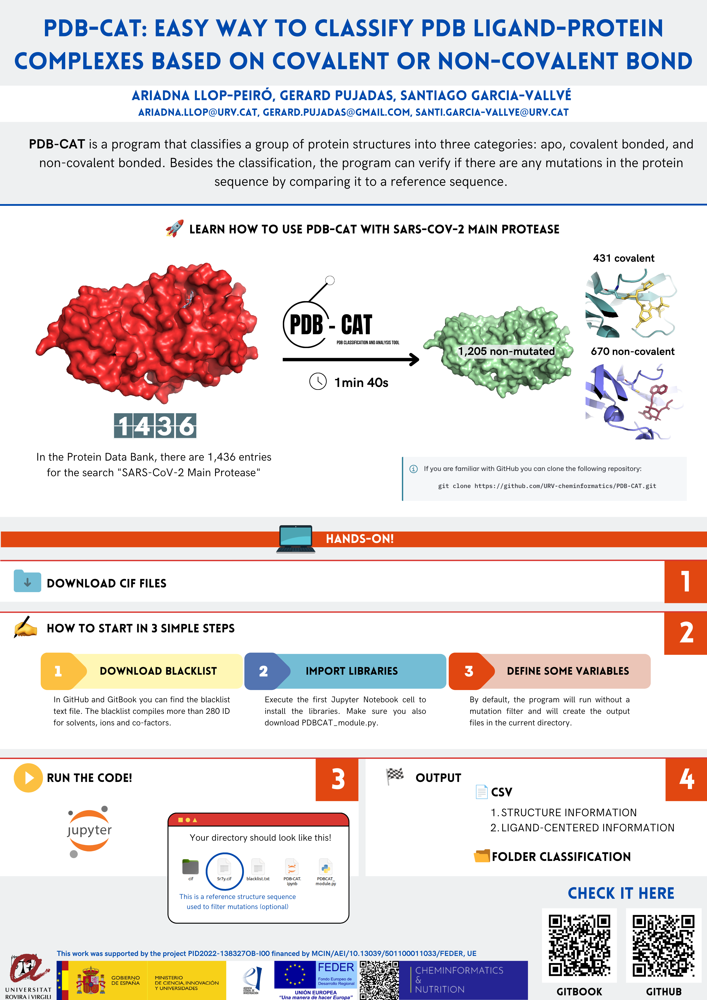

# PDB-CAT: Classification and Analysis Tool 

<a target="_blank" href="https://colab.research.google.com/github/URV-cheminformatics/PDB-CAT/blob/main/PDB-CAT-colab.ipynb">
  
</a>


PDB-CAT is a Jupyter Notebook that aims to automatically categorize the PDB structures based on the type of interaction between atoms in the protein and the ligand, and checking for any mutations in the sequence. 

PDB-CAT is a program that classifies a group of protein structures based on their ligands into three categories: apo, covalently, and non-covalently bonded. Besides this classification, the program can verify if there are any mutations in the protein sequence by comparing it to a reference sequence. PDB-CAT is designed to be user-friendly, with its output clearly defining every entity present in each entry to facilitate decision-making.

## Documentation



## Installation

Python3.10 or higher is required.
Install required packages using:

```bash
  pip install -r requirements.txt
```


## Quickstart

Option 1. Clone 

```bash
  git clone https://github.com/URV-cheminformatics/PDB-CAT.git

```

Option 2. Download

1. Click on the green button labeled '<>Code' in the top right corner
2. Select 'Download zip'

You now have a copy of the repository's files saved as a zip file on your local computer. You can edit and customize the files for your own purposes.

For more information:

[Downloading files from GitHub webpage](https://docs.github.com/en/get-started/quickstart/downloading-files-from-github)


## Dataset

In order to create the Dataset there are two options:

1. Search your protein target in Protein Data Bank and download the PDBx/mmCIF files in batches

[Downloading files from PDB webpage](https://www.rcsb.org/downloads)

2. Download the structures of known IDs with the following executable:

  [batch-download script](https://www.rcsb.org/docs/programmatic-access/batch-downloads-with-shell-script)

  **-f** specify input file with id separate by comma

  **-c** for cif-gz file

  **-o** specifiy output path

```bash
  ./batch_download.sh -f input.txt -c -o /output # execute to download by ID names
```
(optional)
```bash
gunzip *.gz # Decompress downloaded .gz
```
Note: The dataset must be in the /cif directory before executing the program.

## Variables

To run this project, you will need to add the following variables to your main code

```python
 # Name of the folder with the cif files to process
folder_name = "Main-protease-cif" 
# Chose a threshold for the number of amino acids, to discriminate between peptides and the subunits of the protein                                               
res_threshold = 20  
# Analyze mutations. True or False        
mutation = True      
# PDB code of the protein to analyze. If mutation is False, this variable is not used.                           
pdb = "rcsb_pdb_SARSCoV2"

```

### Choose to use mutation filter
```python
Mutation = True   
```
Example SARS-CoV-2 variants
```python
Mutation = False 
```
Example PDBBind

## Blacklist

The blacklist compiles more than 280 codes for solvents, ions, co-factors, and other substances capable of bonding with the protein structure. 
This information is stored in a text file that users can edit, allowing for the inclusion of new codes or adjustments related to the significance of co-factors and solvents in the analysis.


## Usage/Examples

Main Protease SARS-CoV-2 Example

Users can follow the procedure in the example directory, making modifications to the main code variables and exploring their possibilities

# Extra

Best Poster Award at the Strasbourg Summer School in Cheminformatics 2024

